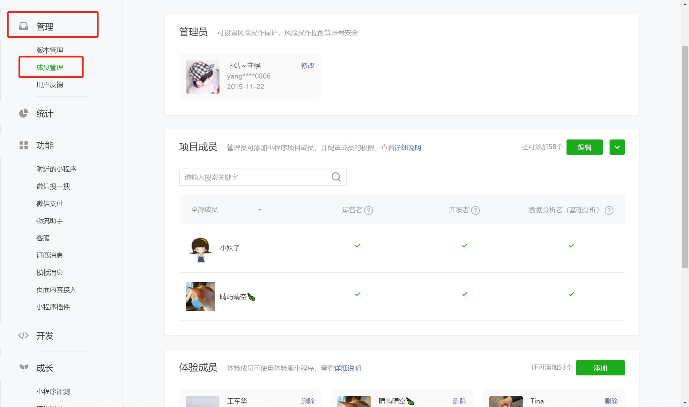
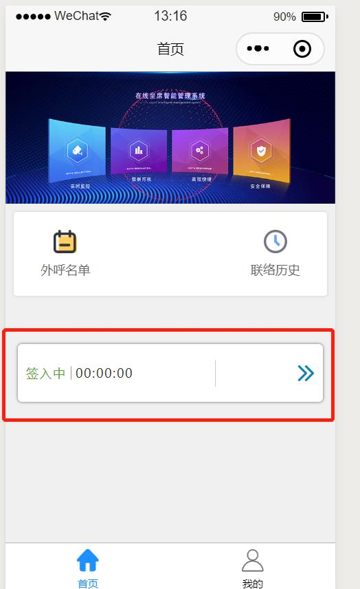

### 1、安装运行

##### 1.1、安装

（1）小程序项目使用的是uni-app框架，需配合HBuilderX编辑器

	开发者工具的下载安装流程
   
    根据自己电脑的操作系统来下载对应的位数
   
    项目名称、目录可默认也可以自己创建，AppID：wx1bc5a925ea2fde68（在微信公众平台--开发--开发设置可以查看）
	
   HBuilderX编辑器下载，下载完成后导入项目代码，注：下载完编辑器需在工具--插件安装--less编译安装
   

（2）微信公众平台登入账号：yangzxsh@sinosoft.com.cn   密码：xcx123456

##### 1.2、运行、上传及配置

 （1） 运行代码：编辑器  运行--运行到小程序模拟器--微信开发者工具   
    首次运行需开启服务端口（工具 -> 设置 -> 安全设置，将服务端口开启）
  
 （2） 体验版：开发者工具上传代码（版本号根据开发版本号叠加）-->微信公众平台-->管理-->版本管理-->开发版本（体验版二维码开发成员可以扫码体验）
  -->
  
 （3）上线小程序版本：开发者工具上传代码-->微信公众平台-->管理-->版本管理-->开发版本-->提交审核（正常5天内可以审核完成，如审核失败需看微信返回的失败原因，修改后再次提交审核）-->审核版本提交上线-->上线版本
  
 
 （4）域名配置：如改域名需在微信公众平台--->开发--->开发设置--->服务器域名修改
  
  
 （5）成员管理：体验版可设置体验的成员，微信公众平台后台添加即可
  
 
### 2、项目结构

##### 2.1、文件夹目录及文件说明

│  App.vue    // 自动提示更新小程序版本、字体图标设置 
│  main.js  // 公共的接口地址 
│  manifest.json  // 配置文件 
│  package-lock.json  // 可用来锁定安装时的版本号，并且需要上传到git，以保证其他人再npm install 时大家的依赖能保证一致
│  pages.json  // 注册页面目录，所有的页面需要注册才能使用，除组件文件外 
│  uni.scss // uni-app内置的常用样式变量
│      
├─components  // 组件
│  ├─gaoyia-parse        //  消息详情文字转换插件
│  │  │ parse.vue   // 做为组件引用
│  │          
│  ├─softphone  //  软电话组件
│  BasicInfo.vue  // 客户信息组件（pages/home/roster/callOut页面有用到）      
│  City.vue  //  案件--报案--出险地点（暂停调试--已注释）    
│  ContactHistory.vue   // 联络历史列表模块组件（pages/home/contact/contact页面有用到）
│  ContactInfo.vue   // 名单信息（pages/home/roster/callOut页面有用到）     
│  CustomInfo.vue  // 外呼名单列表（pages/home/roster/roster页面有用到）
│  Exhale.vue  //软电话呼出弹屏          
│  Inbound.vue   //软电话呼入弹屏
│  MsgList.vue  // 消息列表（pages/mine/news页面有用到）
│  News.vue   // 消息实时推送组件
│  Questionnaire.vue  // 问卷组件 （pages/home/roster/callOut页面有用到）     
└─ Service.vue  // 服务小结填写组件（pages/home/roster/callOut页面有用到） 
│          
├─js_sdk   // md5加密文件
│      
├─pages    // 所有页面文件
│  ├─home  // 首页的所有页面
│  │  ├─case //案件的所有页面（暂不做）
│  │  │
│  │  ├─contact //联络历史所有页面
│  │  │ 
│  │  ├─order //工单管理所有页面（暂不做）
│  │  │
│  │  ├─policy //保单所有页面（暂不做）
│  │  │
│  │  ├─roster //外呼名单所有页面
│  │  │
│  │  └─task //任务所有页面（暂不做）
│  │  
│  ├─index  // 主页面
│  │  │  home.vue //首页主页面
│  │  │  login.vue //登入页面
│  │  └─ mine.vue //我的页面（个人中心页面）
│  │  
└─ mine  // 我的--消息页面
│   │  news.vue //消息已读、未读页面
│   └─ notice.vue //消息详情
│           
├─static  // 静态文件
│  ├─  font //阿里图标
│  └─  images // 存放图片
│          
├─store  // vuex值
   │  index.js //主要用来存储登入返回的值、软电话实时返回数据


### 3、uni-app框架说明   [框架官网地址](https://uniapp.dcloud.io/)

##### 3.1、登录逻辑框架官网地址

（1）项目登入页面（pages/index/login）

```javascript
  ...mapMutations(['login']) //存储登入后续需要用到的值到 store/index.js文件
```

（2）getStorage数据缓存，用于下次登入默认为上次输入的账号密码

##### 3.2、主页面

（1）首页（pages/index/home）

```javascript
// 计算属性部分
computed: {
	...mapState(['hasLogin', 'uerInfo']), //读取store/index.js文件登入接口返回的值
	//获取软电话实时事件
	phoneReceiveObj() {
		return this.$store.state.phoneReceiveObj
	},
},

watch: {
	//监听获取软电话实时事件，用于pages/home/roster/callOut页面拨打电话能重新拨号出去
	phoneReceiveObj(curData, prevData) {
		this.socketObj = curData
	},
},
onLoad() //页面加载时连接并初始化软电话、消息实时推送连接

methods: {
	...mapMutations(['setNewsReceiveObj', 'setPhoneReceiveObj']) //读取store/index.js文件消息、软电话实时返回值
}
```

（2）我的（pages/index/mine）

```html
 <News></News> //消息推送组件
```

##### 3.3、子页面

（1）外呼名单（pages/home/roster/callOut）
```javascript
	onLoad(options) //主要获取上个页面传过来的值 
	api.getPhoneCode() //函数是获取（components/softphone/config/api.js）文件手机归属地

```

### 4、功能开发

##### 4.1、路由跳转

（1）跳转下一个页面

 navigateTo、redirectTo、switchTab、navigateBack几个函数
```javascript
//关闭所有页面，打开到应用内的某个页面。
	uni.reLaunch({ 
		url: '/pages/index/home'
	})
```

（2）组件的引用
```javascript
	// 1 引入组件
	import News from "@/components/News.vue";
	
	//2 注册组件
	components: {
		News
	},
	//3 html写组件标签
	<News></News>
	
```

（3）引入文件
```javascript
	// 1 引入文件
	import common from "@/components/softphone/config/common";
	//2 文件函数使用
	common.getCurrentDay()

```

##### 4.2、阿里巴巴图标库icon

（1）使用了部分阿里巴巴矢量图标（如首页菜单的 icon ），在阿里巴巴矢量图标库项目中维护所有icon，下载到本地后解压，将 其中的iconfont.css、eot、tff、svg、woff文件替换到项目  /static/font  文件夹中 。在 App.vue 中有全局引入这里的样式。

（2）使用。使用 class="iconfont"固定写的方式，在demo_index.html里有所有icon的类名

```jsx
// iconfont类：使用阿里巴巴图标， 图标类名： &#xe671;
<text class="iconfont">&#xe671;</text>
```

##### 4.3、数据字典

（1）在用户登录后，在需获取字典数据的页面提取数据缓存

```javascript
// 在methods写上
methods: {
	//获取数据字典相应的值
	getItemData(rs) {
		var dataObj = {}
		dataObj.name = rs.dataValue
		dataObj.id = rs.dataKey
		return dataObj
	},
}
//设置变量
data() {
	return {
		selectArr: [], //所有下拉列表的值
	}
},

//获取数据字典
	var self = this
	uni.getStorage({
		key: 'allDate',//在登入页面(pages/index/login)使用了uni.setStorage ,key: 'allDate',所有这里写allDate即可
		success: function(res) {
			if (res.data) {
				self.allDate = res.data
				// 获取对应下拉框的数据
				self.allDate.forEach(function(rs) {
					if (rs.classify == 'history.queryArry') {
						self.selectArr[].push(self.getItemData(rs))
					}
				});
			}
		}
	})

```

##### 4.4、API接口调用

调用后台API接口，完整参数如下
```javascript
	uni.request({
	    method: 'GET',//post/get请求方式
	    url: this.apiDomian+'/dictionary/useable', //this.apiDomian公共的域名/IP地址，在main.js文件查看
	    data: {
			username: self.username,//需传的参数
		},
	    header: { //请求头设置
	        'content-type': 'application/json',
			'Authorization': 'Arch6WithCloud ' + token
	    }
	    
	})
	//成功后回调
	.then((data) => {
	})

```

##### 4.5、组件传值
```javascript
	//子传父
	子级：this.$emit("传递的名字写这里getPhoneObj",'传递的值写这里'); 
	父级接收值：<Softphone @getPhoneObj="getCallPhone"><Softphone> //getPhoneObj子级的名字，getCallPhone父级写的方法，并执行相应的操作
	
	//父传子
	父级：<Softphone :stra="setStateCallId"><Softphone> //stra为名字，setStateCallId为需传的值
	子级接收值：props:['stra']
	
```

##### 4.6、下拉加载函数，列表均有用到
```javascript
	onReachBottom(){
		this.getNewsMsg()
	}
	
```


##### **5、软电话与弹屏**

软电话主要components/softPhone文件夹。

**5.1 softPhone组件结构**

##### <softPhone>

├─softphone  //  软电话组件
│  ├─config     // 公共的请求函数文件夹
│  │  ├─socket   // 软电话的公共请求函数文件夹
│  │  │  aspect.js  //aspect软电话的请求函数
│  │  │  main.js  //区分亚太客户与aspect客户
│  │  └─ yatai.js  //亚太软电话的请求函数
│  │  api.js  //公共的请求函数
│  └─ common.js //判断手机号格式、时间的函数
│  │  
│  ├─ css  // 软电话的样式文件夹
│  AgreeLogin.vue  // 示忙中
│  Answer.vue    // 接听     
│  Available.vue // 示闲
│  Callcontent.vue // 外拨连接中
│  Callphone.vue // 暂放中（可拨号）
│  Callsuccess.vue // 通话中
│  Consult.vue // 咨询中
│  Handup.vue // 外拨振铃中
│  Hold.vue // 保持中
│  index.vue // 软电话主文件（判断显示状态组件）
│  Login.vue // 未签入状态 
│  Logining.vue // 签入中状态 
│  Meeting.vue // 会议通话中 
└─ Reprocessing  // 后处理

**5.2 软电话连接**

（1）在首页pages/index/home引入了软电话的组件并建立软电话连接
```javascript
//引入组件
 import Softphone from "@/components/softphone/index.vue";
 
 //判断并建立软电话连接
  var socketConnectUrl;
  if (this.uerInfo.platformType == 3) {
  	//亚太测试环境接口
  	socketConnectUrl = 'wss://zkr-softphone.apiins.com/msg'
  } else {
  	//PC aspect测试环境接口可连接
  	socketConnectUrl = 'ws://192.168.1.192:9093/softPhone/?userId=test5&portal=10.9.11.122:8180&EIO=3&transport=websocket'
  }

  // 连接软电话socket
  let SocketSoftPhone = uni.connectSocket({
  	url: socketConnectUrl,
  	success: function(event) {
  		console.log('软电话连接成功')
  	},
  	fail: function(event) {
  		console.log('软电话连接失败')
  	},
  })
 
```

（2）softphone/index.vue为软电话的主入口文件，这根据实时事件判断显示哪个状态组件。

```javascript
//此文件为区分亚太客户 aspect客户接口
	import socketMain from "@/components/softphone/config/socket/main";

watch:{}//函数为实时监听返回事件
```


（3）对外全局引用函数
```javascript
//module.exports固定写（这样外部可以引用此函数）
module.exports.hangUp = function(uerInfo,cb){ //外部可以引用hangUp此函数
	uni.sendSocketMessage({
		//这里可以做一些发送请求数据
	});
},
```

**5.3 事件数据**

 亚太客户的软电话返回事件
 
（1）实时返回的事件
	ORIGINATED   接通中
	CONNECTION_CLEARED   挂断
	DELIVERED   振铃 
	ESTABLISHED   通话中
	SERVICE_INITIATED   服务连接
	TRANSFERRED   转接
	FAILED   错误
	
（2）主动触发按钮成功过后返回的事件（res == 1出现以下事件）
	init 签入中
	agent_login 签入成功
	gent_logout 签出成功
	agent_available示闲中
	agent_auxwork示忙中
	make_call拨打电话
	answer 接听
	hold   保持
	unhold 取消保持
	ini_consult  咨询
	finish_conference 会议
	finish_transfer 转接

aspect客户的软电话返回事件

	（1）event_notready 示忙事件  dataobj[1].toParkState === true 为 暂放，否则示忙
	
	（2）event_dialing 振铃事件
	
	​		dataobj[1].statusReason == 14   外拨振铃
	
	​		dataobj[1].statusReason == 10  外部咨询振铃
	
	​		dataobj[1].statusReason == 17 内部咨询坐席振铃
	
	（3）event_screenpop 转接
	
	​		dataobj[1].statusReason == 17  别的坐席咨询呼入或转接呼入
	
	​		dataobj[1].statusReason === 8  自动外呼
	
	​		dataobj[1].statusReason == = 1  呼入

	（4）event_active接通中
	
	​		dataobj[1].statusReason == 14  被咨询通话
	
	（5）event_wrap  进入后处理
	
	​		dataobj[1].recordNum
	
	（6）event_login 登录成功
	
	（7）event_callclear 挂断事件
	
	​		dataobj[1].statusReason === 1  被咨询方挂断，
	
	​		dataobj[1].statusReason === 6  咨询方挂断
	
	（8）event_error  错误事件
	
	​		dataobj[1].errorCode === 40  客户挂断
	
	​		dataobj[1].errorCode === 246  忙音 未接通
	
	​		dataobj[1].errorCode !== 245 && data.errorCode !== 20  显示错误提示

**5.4 弹屏**

在振铃DELIVERED事件中，判断route_name='pages/home/roster/callOut'外呼详情里面的话就不需要弹屏，其它页面就需要弹屏,并且出现弹屏后再出现振铃事件就不需要再弹屏toCallFlag

**5.5 软电话主入口文件说明**

在components/index文件为软电话的主文件

（1）switch (receiveEven.name) 函数里面内容根据软电话返回事件eventname，来判断显示的组件状态 
    case receiveEven.type[1] 挂断，返回事件eventname不能区别客户挂断、被咨询方挂断、咨询方挂断，这里结合了localstate的值来区分

（2）后处理，接通电话后需要填写服务小结后方可结束后处理，在接通后设置了一个缓存变量为false，当填写了服务小结后变量变成true
```javascript
// 设置不可结束软电话
	uni.setStorage({
		key: 'endPhoneFlag',
		data: false,
		success: function() {
		},
	});
	
	//弹屏中，提交服务小结的时候可结束软电话
	formSubmit() {
		uni.setStorage({
			key: 'endPhoneFlag',
			data: true,
			success: function() {
			}
		});
	}
```

（3）咨询时触发的事件也可能会让显示的状态错乱（如：在咨询其它坐席或外部号码时，返回的事件eventname也会有从振铃到挂断的流程，这样显示的状态需要与前面客户呼入的振铃到挂断做区别）
这里用了一个变量meeting_flag来标识是咨询的操作，显示的状态避免了错误

（4）新建通话的接口说明  采用es6异步函数的请求方式,避免了代码多重嵌套，请求顺序混乱，
具体可了解async和await函数

（5）软电话显示的位置说明  
```html
<view :class="['phone-wrap', class_a == 1 ? 'bottom' : 'top'] " >//在首页的时候软电话在菜单下方显示，在信息详情页面时候显示在页面的上方

```